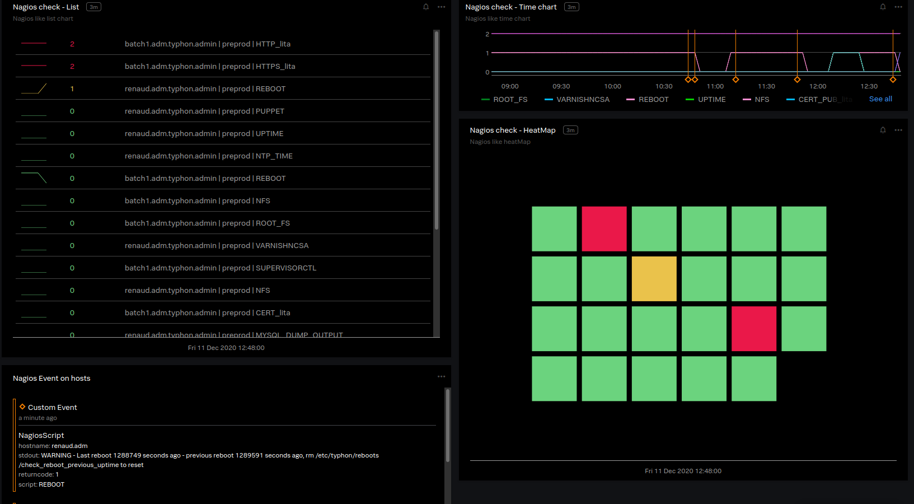

# NAGIOS-STATUS-CHECK SignalFx dashboards



## Usage

This can help you migrate from a "Nagios like" system to SignalFx.

```
module "signalfx-dashboards-smart-agent-nagios-status-check" {
  source = "github.com/claranet/terraform-signalfx-dashboards.git//modules/smart-agent_nagios-status-check"

  timerange = "-4h"
}
```

## Detectors links

This dashboards group uses data (metrics and events) sent by the 
[nagios](https://docs.signalfx.com/en/latest/integrations/agent/monitors/nagios.html) monitor.

For now there is no explicit detectors links to dashboards because it could be redundant from 
`nagios.state` event but it could be added in future if it makes sens.
Furthermore, you may not want all "Nagios like" monitors to have a detectors associated with it.

So, you do not need to deploy corresponding detectors but you can follow the [same 
documentation](https://github.com/claranet/terraform-signalfx-detectors/tree/master/modules/smart-agent_nagios-status-check#how-to-collect-required-metrics) 
to configure the data collection required for this dashboard group.

