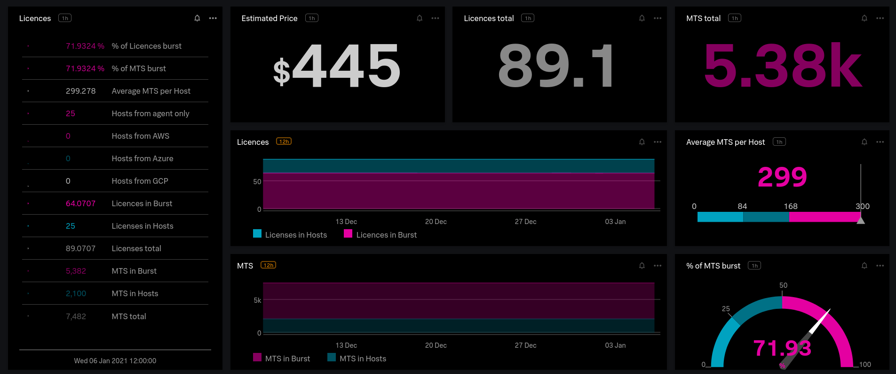

# Organization MTS usage dashboards



## How to use this module?

```hcl
module "signalfx-dashboards-organization-usage-mts" {
  source = "github.com/claranet/terraform-signalfx-dashboards.git//organization/usage-mts"

  #is_parent = false # Uncomment if deployed on child org
}

```

## Notes

- A `Host` represents a real host monitored (either from the agent, the cloud integration or both of them)
- A `Licence` is the unit to bill. 
- `var.licence_pool` is the number of metrics which represent a licence in burst
- `var.licence_price` is the price for one licence
- Each real `host` will count a licence (no matter the number of metrics for it) but it will provide a global number of included metrics (`hosts*var.licence_pool`)
- If the total of MTS exceed this capacity so MTS will be billed in burst
- So the licences total == hosts total + exceeding MTS / `var.licence_pool`

For example, suppose you have:
- `var.licence = 84` (the default)
- `10` Hosts in total
- `900` MTS in total

the estimated price will be:
- `10` licences for the `10` real hosts
- `(900-10*84)/84=0.714` licences for burst

so a total of `10.714` licences.
